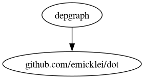

# depgraph

This Go application builds a graph representation of the dependencies within a Go module.

## Installation
```sh
go install github.com/fatimalkaus/depgrapth@latest
```

## Usage

```sh
go run main.go -depth <depth_value> -reg <regex_string> <optional_module_path>
```

## Parameters
* ```-depth```: Specifies the maximum depth for building the graph (default is 10).

* ```-reg```: Specifies the regular expression for filtering the dependencies.

* ```<optional_module_path>```: Optional path to the module. If not provided, the current working directory will be used.
## Output
The application outputs the graph representation on the DOT format of the dependencies to the standard output.
## Example
```sh
depgrapth -reg="github" -depth=15 | dot -Tpng > out.png
```


